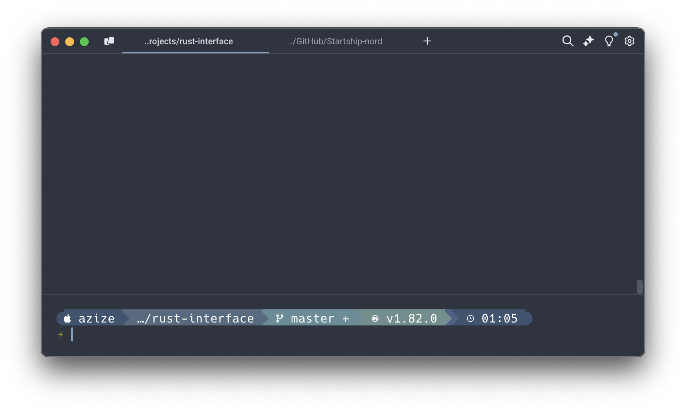

# Custom (Warp) Nord Theme for Starship

This repository contains a custom theme based on the **Nord** color palette for the [Starship prompt](https://starship.rs/). Starship is a cross-shell prompt that is fast, customizable, and intuitive.

This theme was inspired by the **Gruvbox Rainbow** theme for Starship, but has been customized to fit my personal preferences using the cool tones of the Nord color palette.

## Preview



## Installation

To use this custom Nord theme with Starship, follow these steps:

1. **Install Starship** (if not already installed):
   ```bash
   curl -sS https://starship.rs/install.sh | sh

2.	**Copy the starship.toml file from this repository into your Starship configuration directory:**
  	   ```bash
      mkdir -p ~/.config && cp starship.toml ~/.config/starship.toml

## Credits

-Inspiration: Gruvbox Rainbow theme for Starship.

-Nord color palette by arcticicestudio.

-Starship is a fast and highly customizable shell prompt.

Feel free to customize the theme by editing the starship.toml file to better suit your preferences.

## Contributing

If you have any suggestions or improvements for this theme, feel free to open a pull request or issue. Contributions are welcome!
